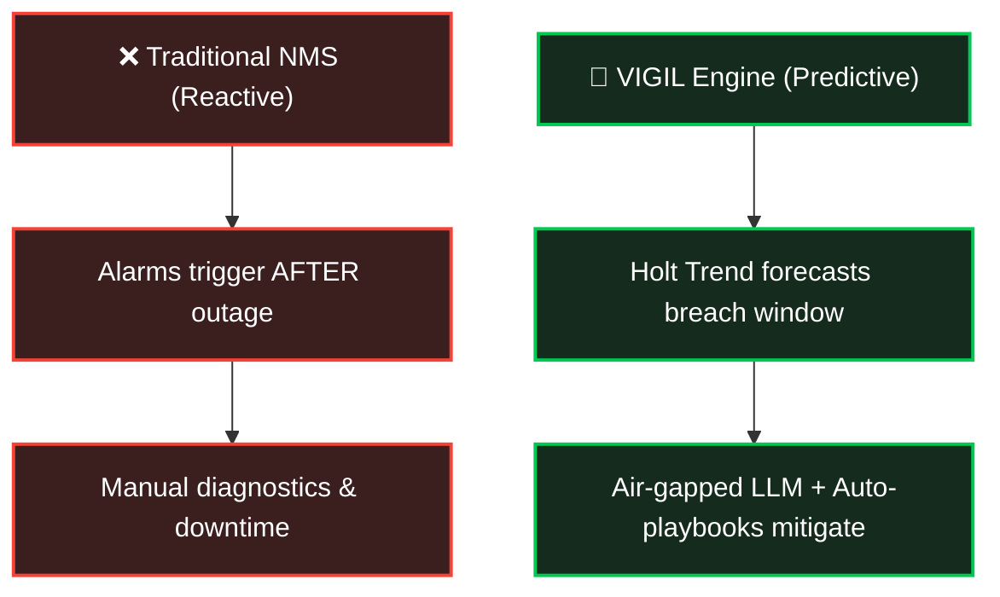
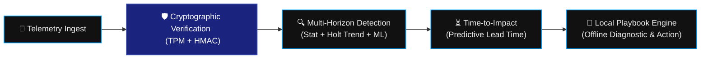
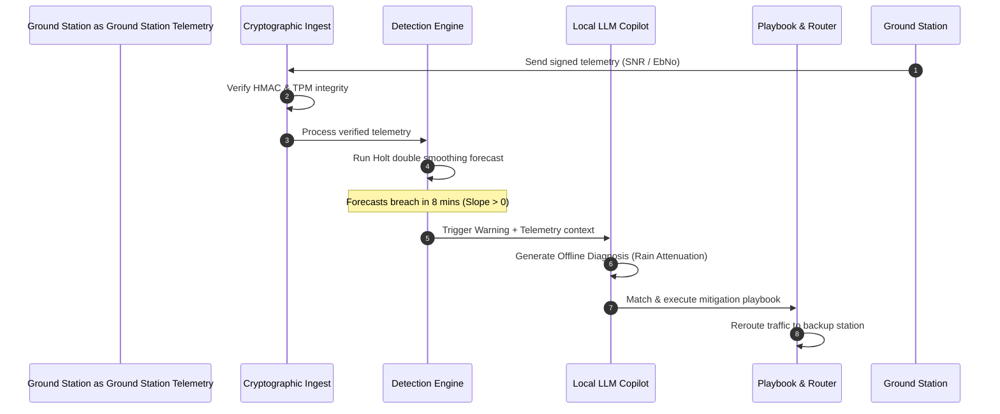
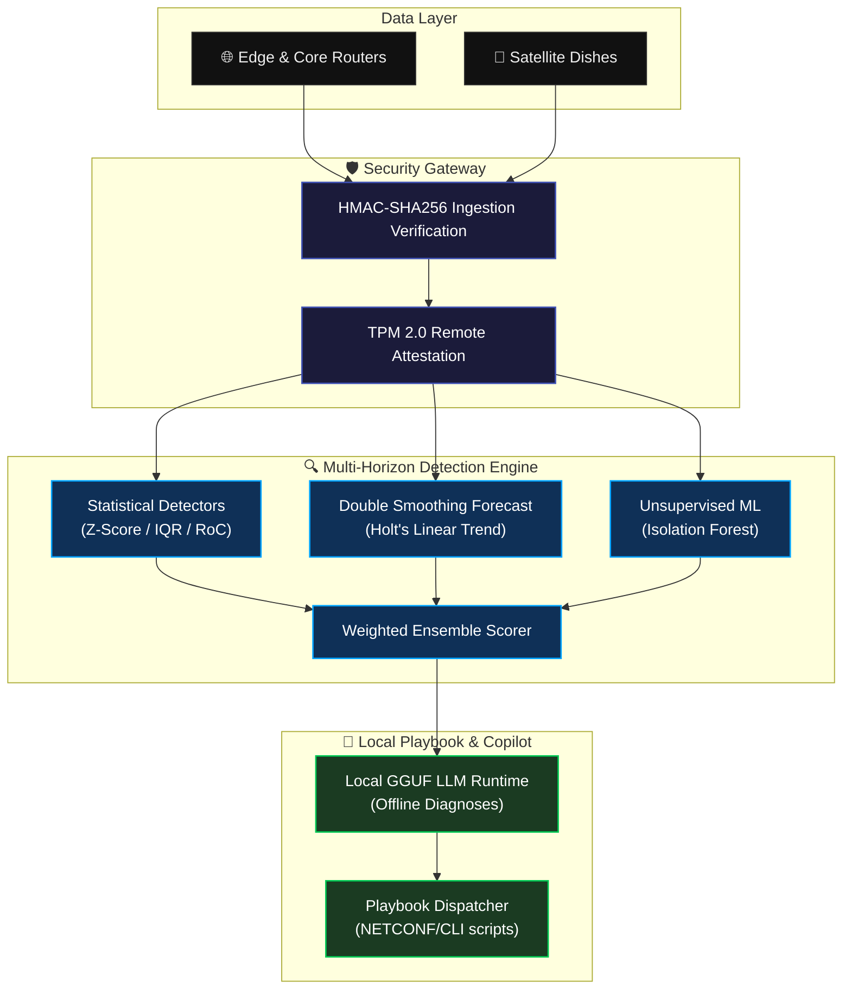

# VIGIL: Unified Presentation Master Deck (ISRO Challenge 13)

This artifact consolidates all required slides into a clean, compact, and highly structured format tailored for small-sized presentation slides. 

---

## Slide 1: The Opportunity & Strategic Differentiation

### **Core Content**
*   **Existing Ideas Limitations:** Traditional Network Management Systems (NMS) are reactive (alerting only *after* outages), depend on external cloud connections, and lack cryptographic validation for telemetry.
*   **How VIGIL Solves This:** Implements double exponential smoothing (Holt's Linear Trend) to forecast threshold breaches (e.g., satellite rain fade) ahead of time, allowing preemptive handovers. It runs 100% locally in air-gapped ground stations.
*   **The USP:** 
    > *"A zero-allocation, cryptographically-anchored predictive defense engine that operates entirely within air-gapped ground networks to forecast link failures and automate local playbooks before service degradation occurs."*

### **Operational Shift Comparison**


---

## Slide 2: List of Features Offered by the Solution

### **Core Content**
*   **Multi-Horizon Detection Engine:** Integrates fast statistical detectors (Z-Score, IQR, RoC) with double exponential smoothing and Isolation Forest ML.
*   **Predictive Time-to-Impact Analytics:** Calculates estimated lead time ($\Delta t = \text{distance} / \text{slope}$) to link breach, allowing proactive routing and dish control.
*   **Hardware-Anchored Security:** Remote TPM 2.0 attestation verifies platform state; HMAC-SHA256 validates telemetry frames to prevent rogue injection.
*   **Air-Gapped Copilot & Local Playbooks:** Runs local GGUF models on ground servers for offline diagnostic reasoning and automated router configuration.

### **Feature Integration Schema**


---

## Slide 3: Process Flow Diagram (Use Case)

### **Core Scenario: Preemptive Rain Fade Mitigation**
1.  **Ingestion & Verification:** Ground station dish telemetry (SNR, Eb/No) is received, signed with HMAC-SHA256, and verified.
2.  **Trend Analysis:** Holt's Linear Trend detects a steady decline in SNR due to approaching rain fade.
3.  **Impact Estimation:** The engine calculates that the SNR will cross the critical threshold ($6.0 \text{ dB}$) in 8 minutes.
4.  **Local Diagnostic:** The Local LLM identifies the root cause as satellite link attenuation and schedules a handover.
5.  **Mitigation Action:** The Playbook Engine automatically reroutes traffic to a neighboring ground station before the active link drops.

### **Telemetry Evaluation Sequence**


---

## Slide 4: System Architecture Diagram

### **System Layers**
*   **Data Layer:** Raw telemetry streams (BGP session events, interface stats, SNMP traps, MPLS LSP status) from routers and satellite antennas.
*   **Security Gateway:** Air-gapped boundary performing signature checks and hardware-anchored trust checks.
*   **Detection Layer:** Welford’s algorithm for stats, Holt's linear trend forecast, Isolation Forest ML models, and the Weighted Ensemble Scorer.
*   **Mitigation Layer:** Local SQLite configuration storage, local LLaMA/GGUF runtime, and SSH/NETCONF script dispatch.



---

## Slide 5: Dashboard Wireframe & Interface Mockup

### **Dashboard Visual Layout Overview**
*   **System Status Header:** Displays uptime, total anomalies, and cryptographic engine health.
*   **Predictive Lead-Time Panel:** Highlights impending link failures, showing the metric, threshold, estimated time-to-impact, and trend confidence.
*   **Real-Time Metrics Grid:** Visualizes current vs. forecasted levels for key telemetry streams.
*   **Active Incidents Console:** Lists current anomalies, model confidence, and the status of automated playbooks.

### **ASCII Wireframe Illustration**
```
+-----------------------------------------------------------------------------+
| VIGIL | GROUND STATION TELEMETRY ENGINE | [SECURE: TPM OK]  [Uptime: 99.98%] |
+-----------------------------------------------------------------------------+
| [⚠️ PREDICTIVE ALERTS]                                                       |
| >> Warning: Rain Fade degradation detected on Antenna-Dish-01               |
|    - Current SNR: 7.2 dB | Threshold Limit: 6.0 dB                         |
|    - Forecasted Breach: In 8 Minutes | Trend Slope: -0.15 dB/min            |
|    - Action Scheduled: Automated link handover to backup site               |
+-----------------------------------------------------------------------------+
| [📈 ACTIVE METRICS MONITOR]                  | [⚙️ ENGINE STATUS]            |
| - latency_us       [ ||||||......... ] 5ms   | - Stats Engine:   RUNNING     |
| - packet_loss_pct  [ ............... ] 0%    | - Holt Smoothing: ACTIVE      |
| - utilization_pct  [ ||||||||||||... ] 72%   | - Isolation Forest: TRAINED   |
+-----------------------------------------------------------------------------+
| [🤖 CO-PILOT DIAGNOSTICS & PLAYBOOKS]                                        |
| Anomaly Event ID: #9822 | Source: Antenna-Dish-01 | Score: 0.72             |
| Diagnosis: "Atmospheric attenuation (rain fade) is degrading signal SNR."   |
| Mitigation Action: Executing Playbook #44 - Switch satellite link to SDSC.  |
| Playbook Status: SUCCESSFUL | Target Link Rerouted                          |
+-----------------------------------------------------------------------------+
```
*(Reference: Visual Mockup saved in workspace as [wireframe_dashboard.md](file:///home/xc0mrade/.gemini/antigravity/brain/c77e5350-4586-43eb-82ef-a92f331cb764/artifacts/wireframe_dashboard.md))*

---

## Slide 6: Technologies to be Used in the Solution

### **Core Stack Components**
*   **Backend & Processing Core (Rust):** Low-overhead, zero-heap allocations. Guarantees memory safety and deterministic CPU usage.
*   **ML Engine (Linfa + Ndarray):** Zero-dependency Rust machine learning framework for Isolation Forest fitting on sliding windows.
*   **Offline LLM Integration (LLaMA.cpp / GGUF):** Quantized open-source models (e.g., Llama-3-8B-Instruct) compiled directly for local CPU execution.
*   **Security Layer (TPM2-TSS):** Platform configuration registers verification combined with ring-buffer cryptographic signatures.
*   **Frontend UI (Vite + React + TypeScript + TailwindCSS):** Modern single-page web app styled with glassmorphic dark-mode dashboards and real-time WebSockets integration.

---

## Slide 7: Estimated Implementation Cost (Development Breakdown)

### **Resource & Timeline Summary**
*   **Estimated Development Time:** 12 Weeks (3 Months).
*   **Personnel:** 2 Backend/Systems Engineers, 1 Frontend/UI Engineer, 1 Space Operations Specialist.

### **Cost Breakdown Matrix**
| Phase | Focus Areas | Est. Hours | Target Cost (USD) |
| :--- | :--- | :--- | :--- |
| **Phase 1: Ingestion & Security** | TPM 2.0 drivers, HMAC signature validations, and message queues. | 160 hrs | $12,000 |
| **Phase 2: Detection & Holt Trend** | Rust maths core, Holt trend calculations, and Isolation Forest integrations. | 240 hrs | $18,000 |
| **Phase 3: Copilot & Playbooks** | GGUF runtime compilation, playbook engines, and router script dispatchers. | 200 hrs | $15,000 |
| **Phase 4: Dashboard UI** | Vite dashboard, real-time plotting, and WebSockets configuration. | 160 hrs | $10,000 |
| **Phase 5: Integration & Validation** | Edge hardware validation, simulated satellite runs, and penetration tests. | 120 hrs | $8,000 |
| **Total Project Estimate** | **Integrated Deployable Solution** | **880 hrs** | **$63,000** |
